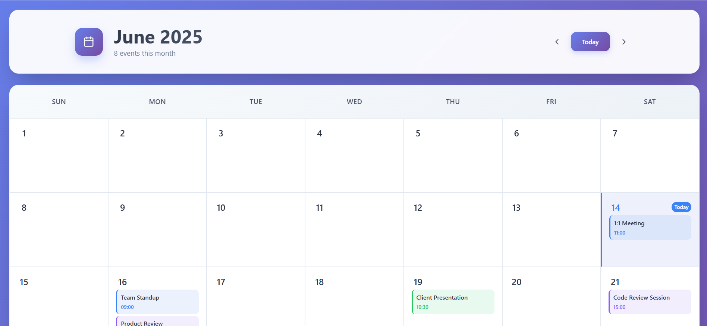

# Calendar-Task

React calendar UI project with month navigation and event rendering.

## What This Project Is
- A calendar web app built with React and custom CSS.
- Displays month grids with event cards and a legend.
- Includes reusable utilities/hooks for date and event handling.

## Main Features
- Month navigation (previous, next, and jump to today).
- Calendar grid generation for each month view.
- Event display per day with color-coded event types.
- Today highlighting and basic event overflow indicator.
- Styled with custom theme variables and animations.

## Tech Stack
- React
- JavaScript
- Custom CSS
- `lucide-react` icons

## Project Structure
- `src/components/` - calendar UI components.
- `src/hooks/useCalendar.js` - calendar state and navigation logic.
- `src/utils/dateUtils.js` - date helpers and month grid generation.
- `src/utils/eventUtils.js` - event filtering/sorting helpers.
- `src/data/events.js` - event seed data and event type mapping.

## Run Locally
```bash
npm install
npm start
```

Build for production:
```bash
npm run build
```

## Preview

